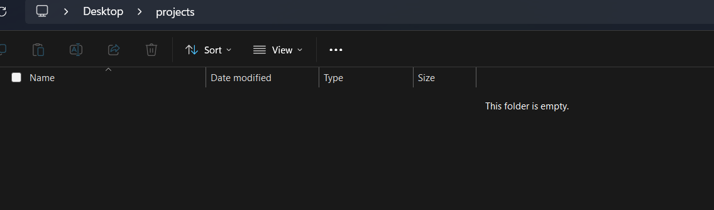

# PWP Assignment

## Prerequisites

- [VsCode](https://code.visualstudio.com/download)
- [Git](https://git-scm.com/downloads)
- [Github account](https://github.com/join)

## Setup guide

1. Open windows file explorer, and navigate to the folder where you want to store the project. Copy the path from the address bar.


2. Open terminal with `Win + R`, type `cmd` and hit enter.  
3. In the terminal, type `cd` followed by the path you copied earlier. Hit enter.

   ```bash
   cd C:\path\to\your\folder
   ```

4. Clone the repository by running the following command:

   ```bash
    git clone https://github.com/Mortis66666/pwp-assignment.git
    ```

5. Open project in VsCode by running:

   ```bash
   code pwp-assignment
    ```

## Edit access

- Send me your github username
- Accept the invite to the repository in email

## Project structure

- `main.py` - Main program file
- `users.txt`, `books.txt`, `borrow_logs.txt` - Data files

## Git guide

### What is Git?

Git is a version control system that helps you track changes to your code over time. It allows multiple people to work on the same project simultaneously without overwriting each other's changes.

### What is GitHub?

GitHub is a web-based platform that hosts Git repositories. It provides a collaborative environment where developers can share code, track issues, and manage projects.

### Syncing workflow

1. Locate the Source Control icon on the left sidebar of VsCode (it looks like a branch with a dot at the end) and click on it. Alternatively, you can use the keyboard shortcut `Ctrl + Shift + G, G` to open the Source Control panel directly. This panel allows you to manage your Git repositories, view changes, and perform various version control operations.

2. Before making any changes, it's important to ensure that your local repository is up to date with the latest changes from the remote repository. To do this, click on the "..." (More Actions) button at the top of the Source Control panel and select "Pull" from the dropdown menu. This action will fetch and merge any changes from the remote repository into your local copy.

3. After pulling the latest changes, you can proceed to make your edits to the code files as needed.

4. Once you've made your changes, return to the Source Control panel. You will see a list of files that have been modified. Review the changes to ensure everything is as expected.

5. To stage your changes for commit, click on the "+" icon next to each file you want to include. This action prepares the files to be committed to the repository.

6. After staging your changes, you'll need to provide a commit message that describes the changes you've made. This message helps others (and yourself) understand the purpose of the changes. Type your commit message in the input box at the top of the Source Control panel.

7. Once you've entered your commit message, click on the commit button (✓ Commit) to commit the changes to your local repository.

8. Finally, to share your changes with others, you'll need to push your commits to the remote repository. Click on the "..." (More Actions) button again and select "Push" from the dropdown menu. This action will upload your committed changes to the remote repository on GitHub.


#### Learn more

[Official VsCode Guide](https://code.visualstudio.com/docs/editor/versioncontrol#_git-support)
